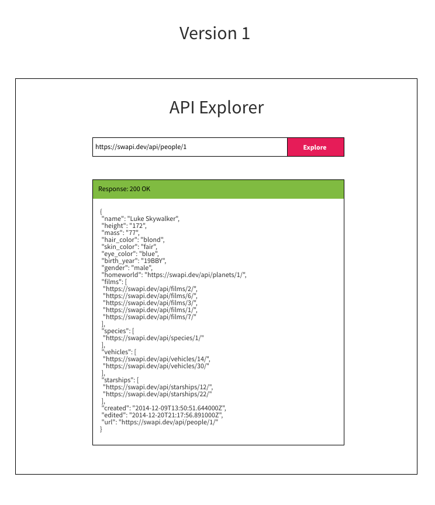

## Exercise - build vanilla JS api explorer

See design



- User puts in a url -> click "Explore"
- Print out the JSON and the status code

- How to make request with vanilla javascript
- window.fetch() ->

Hint 1:

```javascript
async function getUserAsync(name) {
  let response = await fetch(`https://api.github.com/users/${name}`);
  let data = await response.json();

  // put elements on the page, select, change properties, create elements
}
```

Hint 2:

If you want to format JSON, consider using

- a <pre> element
- JSON.stringify({ hello: 'hello'}, null, 4)
